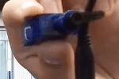
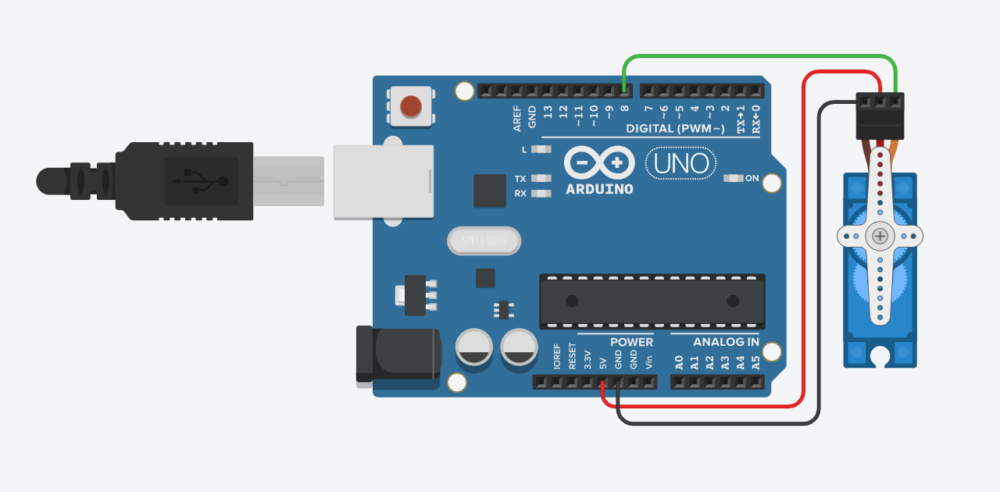
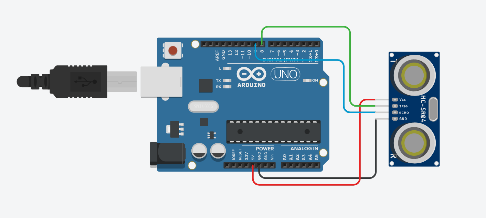
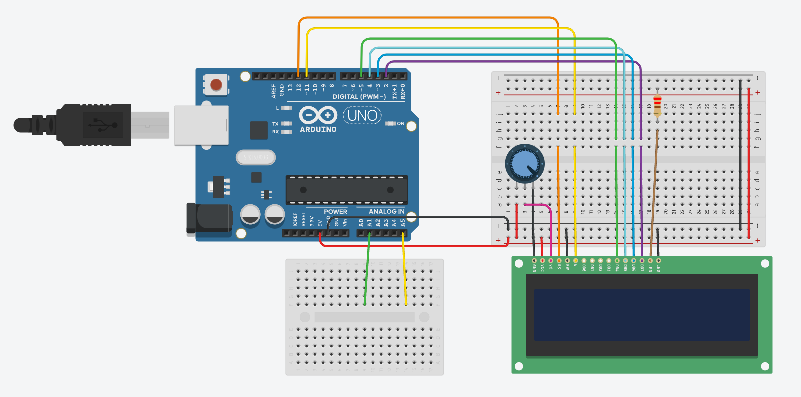

# Engineering 3: CircuitPython

## Table of Contents
* [Table of Contents](#TableOfContents)
* [Hello_CircuitPython](#Hello_CircuitPython)
* [CircuitPython_Servo](#CircuitPython_Servo)
* [CircuitPython_Ultrasonic](#CircuitPython_Ultrasonic)
* [CircuitPython_LCD](#CircuitPython_LCD)


## Hello_CircuitPython (ledShift)
For this assignment, I coded with circuit python on Mu and made the neopixel on my Metro express shift colors.

### Code

[LED Shift](ledShift.py)

### Evidence


### Wiring

N/A, plug Metro into PC via USB.

### Reflection
* learning syntax different from Arduino - I had to get used to writing code differently than I did last year. For example, there are no semicolons at the end of phrases in Circuit Python.
* not getting ahead of myself - I found that it was best to start simple when learning a new coding language.
* troubleshooting errors on the Metro Express - The Metro Express was indicating that it had an error by flashing the Neopixel, so I had to look in the serial monitor to figure out what the problem was and fix it.


## CircuitPython_Servo
For this assignment, I coded with circuit python on Mu and made a 180 degree servo sweep back and forth.

### Code

[Servo Sweep](servo.py)
```python
##TLDR
while True:
    myServo.angle = 0 ##Sets servo angle
    time.sleep(1)     ##Waits one second
    myServo.angle = 180
    time.sleep(1)
```
### Evidence


Credit: 

[afriedm49 repo](https://github.com/afriedm49/Circuit_Python_Asher)

### Wiring



### Reflection
The assignment was relatively straightforward, but the only unintuitive aspect was making sure to add the servo.mpy file from the adafruit_motor folder. This file had to go in the lib folder in the Metro, and the library had to be added at the beginnig of the code. 


## CircuitPython_Ultrasonic
For this assignment, I used an HCSR04 ultrasonic sensor to detect a distance. The Neopixel on the Metro Express displays a range of colors depending on the distance being detected by the ultrasonic sensor. 

### Code

[UltrasonicLedShift](ultrasonic.py)
```python
##TLDR
if sonar.distance >= 5 and sonar.distance < 20:
            blue = simpleio.map_range(sonar.distance, 5, 20, 0, 255) ##Maps the value blue between 0 and 255 and distance 5 to 20cm
            red = simpleio.map_range(sonar.distance, 5, 20, 255, 0)
            r = int(red)
            b = int(blue)           ##Changes float output of simpleio map to an integer
            led.fill((r, 0, b))     ##Inputs the integer as the RGB value in the LED
```

### Evidence


Credit: 

[afriedm49 repo](https://github.com/afriedm49/Circuit_Python_Asher)

### Wiring



### Reflection
Don't forget to add the simpleio.mpy file in the lib folder! Also, make sure the IF statements are all formatted correctly.

## CircuitPython_LCD
For this assignment, I wired and coded an LCD display and two capacative touch wires. One wire changes the count state to up or down, and the other changes the counter, both of which are displayed on the LCD screen.

### Code

[LCD](lcd.py)
```python
##TLDR
while True:
    if touch.value and a == 0 and c == 0:
        lcd.clear()
        a += 1
        lcd.print(str(b))
        lcd.print("\nUp")
    elif touch.value and a == 1 and c == 0:
        lcd.clear()
        a -= 1
        lcd.print(str(b))
        lcd.print("\nDown")
    c = touch.value
    if touch2.value and a == 1 and d == 0:
        lcd.clear()
        b += 1
        lcd.print(str(b))
        lcd.print("\nUp")
    elif touch2.value and a == 0 and d == 0:
        lcd.clear()
        b -= 1
        lcd.print(str(b))
        lcd.print("\nDown")
    d = touch2.value
```

### Evidence


### Wiring

This diagram shows how to wire the LCD screen manually with one wire going to each pin. I used an LCD backpack for this assignment, so I only had four wires (VIN, GND, and the two LCD i2C signal pins, which are on the MetroExpress as well. 



### Reflection

The most difficult part of this assignment was not getting confused by all the different variables. I had one variable to represent the switch state (up/down), one variable to act as a counter, and two variables (one per wire) to represent whether or not the wires are being touched. The last two variables make it so that if a wire is touched continuously, it will not count multiple times.
